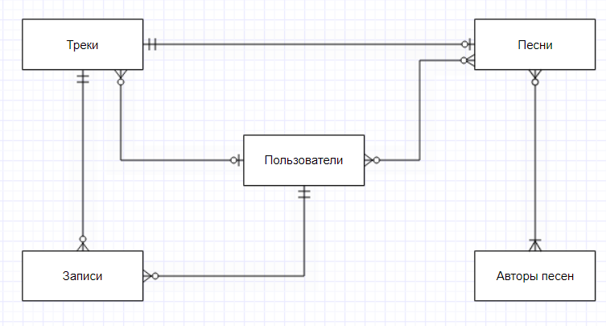

# DataBaseProject

## Задание 1

Предметная область: База данных по персонажам циклов аниме "Наруто"

В аниме есть множество героев, поэтому удобно было бы иметь базу данных с ними. 
Мы будем рассматривать только ниндзя, поэтому что это самые важные и интересные герои мультсериала.
Фанбаза постоянно растет, аниме приобритает сиквелы и фильмы, поэтому такая база данных будет актуальна.

### Сущности

#### Ниндзя
Самое главное в аниме про ниндзя - это сами ниндзя, это будет самая большая таблица в нашей базе. 

#### Объединение
Большинство ниндзя собираются в какие то объединения или организации. Это могут быть деревни,
организации злодеев или что то еще. Ниндзя могут переходить из одного объединения в другое.

#### Команда
В объединениях выделяются команды - это маленькие группы по 2-3 человека.

#### Предводитель
У каждого объединения есть предводитель. Например, каге - главы деревень, которые меняются со временем.
Предводители также есть у команд, например, наставники. Но есть и команды, действующие сами по себе.

#### Хвостатые
Хвостатые - это звери, обладающие огромным запасом чакры. Хвостатые заключены в ниндзя, которые являются их носителями. 
Когда носитель умирает, зверя переселяют в другого ниндзя, поэтому у Хвостатых много носителей.
Обычно хвостатые закреплены за какой то конкретной деревней, которая является объединением.

### Версионность

Будем поддерживать версионность для принадлежности ниндзя объединению. 
За точку отсчета возьмем дату создания первой деревни скрытого листа,
так как именно после неё разворачиваются основные события сюжета.

## Задание 2

Концептуальная модель:

